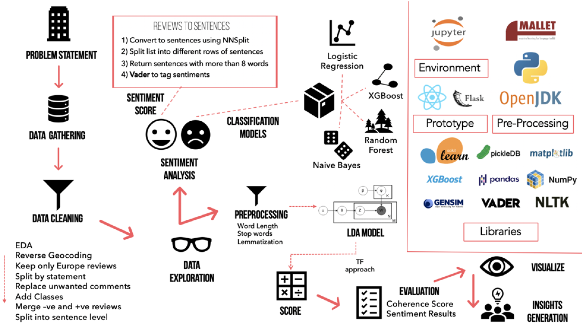

# text_mining_project

## Purpose
This project analyse text generated from customer reviews on hotels around Europe.

## Techniques
The different text mining techniques used include:
* Document Classification
  * Logtistic Regression
  * XGBoost
  * Random Forest
  * Naïve Bayes
* Sentiment Analysis
  * Vader Sentiment
* Topic Modelling
  * LDA
    * Mallet
    * Gensim

## Data Pipeline

## Dataset
Data is taken from https://www.kaggle.com/jiashenliu/515k-hotel-reviews-data-in-europe/data#
